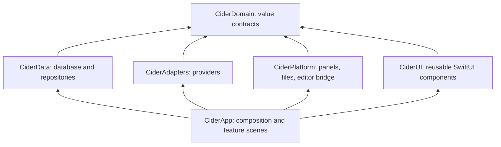

# Native architecture and concurrency

## Linked-work implementation

`AppModel` owns the ready SQLite repository. `LinkedWorkCoordinator` supplies the same repository and host identity to TODO detail, note relationships, graph and context services. `CiderApp` injects `JournalIngestor` before observer startup; failed migration never enables an empty replacement board or acknowledges pending events through a fallback path.

SQLite and coordinated note I/O run on dedicated utility serial executors. Graph layout is bounded, cancellable work, with no persistent graph database or continuous simulation. `cider-cli` uses the same read contract in read-only mode. The application packages it as `Contents/Helpers/cider`, alongside the portable workflow skill and schema bundle. No provider configuration changes are performed by startup. See [linked-work implementation](progress/linked-work-14.md).


Status: proposed. Local toolchain inspected: macOS 26.6.2, Xcode 26.4, Apple Swift 6.3, arm64. No Cider native target has been built.

## Runtime shape

One native app process owns the workspace and HUD. SwiftUI owns scenes, visible state, and reusable components. AppKit owns the nonactivating notch panel, display enumeration, file coordination, pasteboard, and native image annotation/capture boundary. One lazy WebKit editor is the user-accepted exception; no Electron or background web server is required in the shipped app.

Use a regular `WindowGroup("Cider", id: "workspace")` for the primary workspace, a `Settings` scene, and `MenuBarExtra` for recovery/quick actions. The `NSApplicationDelegateAdaptor` wires the notch controller and system lifecycle only. First launch opens the workspace. A deliberate preference can later use accessory/no-Dock behavior; there must always be a menu-bar way back.

The hover HUD never becomes key. Clicking its task field opens a key-capable native capture panel aligned with the reserved composer area so typing appears within the notch. The capture lease holds the HUD open; closing restores the prior focus where supported. Full editing opens the workspace. SwiftUI preview fixtures contain no provider clients. See [task capture](design/tasks-and-capture.md) and [materials](design/materials.md).

## Target boundaries



Begin with one Swift package containing these targets and a thin application bundle project. Domain depends only on small value-level standard/Foundation APIs. Dependencies are injected at composition; views never read provider files, spawn processes, or issue SQL. Group feature files by Inbox, Features, Today, Notes, Usage, and Settings within the app target. Split a target further only for a concrete boundary or independent testing benefit.

```text
App/                         App entrypoint, composition, scene declarations
Sources/CiderDomain/        IDs, events, snapshots, protocols, reducers
Sources/CiderData/          Migrations, database access, repositories
Sources/CiderAdapters/      Codex/, Claude/, Cursor/, Jira/, Manual/
Sources/CiderPlatform/      Display/, Panels/, Documents/, Editor/, Capture/
Sources/CiderUI/            Tokens/, Components/, Styles/
Features/                   Inbox/, Features/, Today/, Notes/, Usage/, Settings/
Tests/                      Domain/, Data/, Adapters/, Platform/, Fixtures/
Resources/Editor/            Pinned local JS/CSS/renderer assets if selected
script/build_and_run.sh      Native .app build and launch (Phase 01)
.codex/environments/         Run-button configuration (Phase 01)
```

## Ownership and isolation


| Owner                                | Isolation                                          | Holds / emits                                                                   |
| ------------------------------------ | -------------------------------------------------- | ------------------------------------------------------------------------------- |
| AppCoordinator                       | `@MainActor @Observable`                           | Small navigation and service-status projection; no full transcripts             |
| SceneState                           | `@MainActor @Observable`, one per workspace window | Selection, open documents, inspector state                                      |
| NotchController / DisplayCoordinator | `@MainActor`                                       | One panel, geometry and tracking resources; publishes tiny HUD snapshot         |
| RunIngestor                          | actor                                              | Dedupe, source cursors, event ordering; commits through database repository     |
| WorkspaceRepository                  | actor facade + GRDB-managed execution              | Task/feature/run/verification transactions; immutable query results             |
| DocumentSession                      | actor, one canonical session per file              | Source buffer revisions, save/conflict state, asset transaction journal         |
| FileAccessService                    | dedicated utility I/O queue behind async API       | Coordinated synchronous filesystem operations and bookmarks                     |
| Provider adapters                    | actors                                             | One session/connection per provider configuration; immutable observations       |
| UsageScheduler                       | actor                                              | Single-flight refresh, jitter/backoff, last-good snapshots                      |
| Editor bridge coordinator            | `@MainActor`                                       | WKWebView, message handler lifecycle, selection revision; never owns file truth |
| Image/parse workers                  | explicit `@concurrent` pure work or bounded worker | Decode, resize, hashing, parse/diff over `Sendable` data                        |

Use Swift 6 strict checking in every target. UI isolation is explicit; core targets keep default nonisolated behavior and pass `Sendable` value snapshots. Enable approachable-concurrency settings deliberately and consistently. `async` does not mean background execution, and `Task {}` inherits isolation. With the newer behavior, a nonisolated async call can retain the caller's actor. CPU-bound parsing must explicitly move off UI isolation. See [Swift concurrency changes](https://www.swift.org/blog/swift-6.2-released/).

Do not use `@unchecked Sendable` or `nonisolated(unsafe)` to silence model errors. Avoid sharing `NSImage`, WebKit objects, mutable database records, or text storage across actors. Pass encoded bytes/IDs/value results, then construct UI objects on their owning actor.

## Flow from agent to view

Adapter → normalized `ObservedEvent` → durable dedupe/order transaction → reducer → immutable `WorkspaceSnapshot` → main-actor projection → subscribed SwiftUI subviews.

Critical input/approval/terminal events are persisted before acknowledging them. UI/progress snapshots can coalesce into `AsyncStream(bufferingNewest: 1)`. Do not send critical events through a dropping stream. A reconnect uses source cursor/sequence plus reconciliation; a buffer overflow emits a resync condition rather than losing a completion silently.

Store only changed records and publish coherent updates. A running timer label must not invalidate the whole workspace or editor. Views receive their relevant values and action closures; use stable entity IDs in `List`, `Table`, and `ForEach`. Keep large history pages off observation hot paths.

## Task lifecycles

- Own long-lived tasks in a service. `start` is idempotent; `stop` cancels and awaits cleanup. Window-scoped work uses `.task(id:)` and cancels when selection changes.
- Use bounded task groups for independent refreshes (initial cap: two). Enforce one in-flight request per account/provider. Avoid a task per log line or an unbounded array of requests.
- Check cancellation during parsing/indexing batches. Before applying an async result, compare its document/query generation so old work cannot replace newer edits.
- `await` permits actor reentrancy. Capture a revision before external work and validate it when committing; actor isolation alone is insufficient for multi-step saves or sync.
- Use `ContinuousClock` for delays/durations, wall clock for timestamps/reset display. Cancel debounces when superseded; never block the main thread to sleep.
- Processes use explicit executable paths and argument arrays, bounded stdout/stderr, concurrent pipe draining, deadlines, and cancellation/termination escalation. Do not shell-interpolate a worktree path or note text.

## Disk and document work

SQLite/GRDB provides one writer and transactional migrations. Notes and assets remain ordinary files. Search indexes are derived and can be rebuilt; don't make SQLite the sole copy of note bodies. Coordinate external editor changes through file presenters/coordinators and a revision hash; never overwrite a detected conflicting update.

Run synchronous filesystem coordination on a dedicated serial utility queue, then resume the async caller. Keep blocking system APIs off Swift's cooperative executor as well as the main actor. Do not hold a database transaction while awaiting network, WebKit, or file-coordination callbacks.

Use thumbnails sized for their visible pixel dimensions, lazy decode, and bounded caches. Preserve original assets on disk. One active rich editor in the MVP; inactive documents retain text/selection/draft state, not a WebKit process each. Multiple-window editing needs a later explicit pool/canonical document-session policy.

## Refresh and energy policy

Implemented usage policy (2026-09-06): app-owned ten-minute refresh plus coalesced provider Stop events, independent requests/loading, last-good values, failure backoff and sleep/wake cancellation. This supersedes the earlier proposed quota intervals below. See [usage refresh evidence](progress/usage-refresh-09.md).

Prefer provider events, filesystem events, and system display notifications. Coalesce visual progress to at most 10 Hz only while visible. Never animate a permanent spinner/glow while idle. Suggested quota refresh: on demand with a 15-second minimum interval, 60 seconds while Usage is visible, five minutes otherwise; jitter and back off after errors, honoring server retry headers. These are starting policies, subject to measurement.

Suspend unnecessary polling when sleeping, locked, disconnected, low-power, or thermally constrained. Reconcile once after wake instead of replaying missed timer ticks. Pointer tracking is event-led; any fallback location poll exists only for a proven hardware gap and must meet the idle energy target.

## Packaging and privacy boundary

Start with a direct-download development app, hardened runtime later; App Sandbox is a separate feasibility decision because CLI/process/hook integration may not fit its default boundaries. Even outside the sandbox, scope file access to chosen folders and provider setup. Store secrets in Keychain only through explicitly configured integrations. No telemetry by default; local `Logger`/signposts use redacted identifiers, timings, and counts.

Generated screenshots/notes/logs are not uploaded automatically. WebKit uses local resources, a nonpersistent store, an allowlisted message protocol and blocked remote navigation. See [editor security and offline gate](research/editor-stack.md). No provider credentials enter the editor process.

## Proposed performance targets

All are targets to validate in a release build on this Mac, including attributable WebKit/helper processes: collapsed idle footprint ≤80 MiB; one representative rich note ≤250 MiB total; CPU <0.5% of one core averaged over ten idle minutes; hover animation frame work within 8.3 ms on 120 Hz; local input-to-display p95 <16 ms; app-owned event-to-Inbox p95 <250 ms excluding provider latency. Fixtures, warm/cold conditions, and measurement procedures are in [verification](verification.md).
