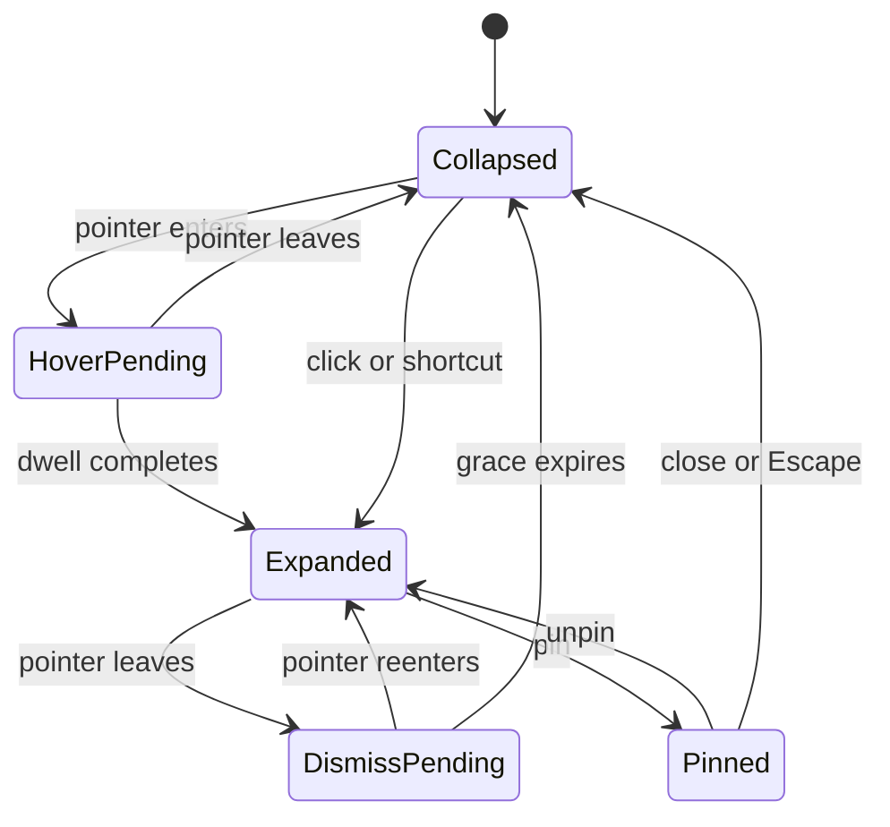

# Notch and display behavior

## Independent settings

| Setting | Default | Alternatives |
| --- | --- | --- |
| Display anchor | Built-in display | Selected display; optional mirror on external display later |
| Edge | Top, centered on physical notch | Left, right, bottom; normalized position along each edge |
| Expansion | Inward from the selected edge | Alignment: start/center/end, with a live position preview |
| Trigger | Hover after 250 ms or explicit click/shortcut | Click only; delay configurable 100–800 ms |
| Dismissal | Pointer leaves for 450 ms, unless pinned | Pin until Escape/click-close |
| Workspace placement | Last normal window location | Open on active display when explicitly requested |

Display anchor controls the HUD. Workspace window placement is separate. **Moving focus to an external display never moves or hides the laptop HUD.** The user can deliberately choose a different anchor in settings.

## Resolve displays

Enumerate `NSScreen.screens`, obtain current CoreGraphics display identities, and use `CGDisplayIsBuiltin` to resolve the built-in role. Do not use `NSScreen.main` or the key window as the default laptop selector. Persist the role and, for selected-display mode, a best-effort stable display UUID; numerical display IDs and array indices are not durable preferences.

Use `safeAreaInsets`, `auxiliaryTopLeftArea`, and `auxiliaryTopRightArea` to determine the hardware exclusion zone. The top outer black surface can visually merge with the camera housing; controls and text remain in the left/right safe wings or below the housing. No fixed global notch-width assumption. Screens without a camera housing use a synthetic compact top tab.

References: [Apple camera-housing guidance](https://developer.apple.com/documentation/bundleresources/information-property-list/nsprefersdisplaysafeareacompatibilitymode), [built-in display API](https://developer.apple.com/documentation/coregraphics/cgdisplayisbuiltin(_:)), and the commit-pinned [source comparison](../research/reference-codebases.md).

React to screen-parameter changes, resolution/scale changes, wake, and workspace-space changes. Compute all frames in AppKit global coordinates; do not assume origins are positive or the menu bar is on the built-in display. Round outer pixel edges using the display scale factor.

If the laptop display is closed, asleep, or unavailable, it cannot show a HUD. Persist the built-in preference, show a menu-bar fallback or user-selected external fallback, and restore automatically when it returns. Settings should say which anchor is temporarily unavailable. Mirrored displays, docked clamshell mode, and reconnect must be tested separately.

## Geometry

Top: compact width = measured camera exclusion + safe content wings; height follows the exclusion/menu-bar geometry. Expanded starting size about 440 × 300 pt, clamped to display safe bounds. Left/right: 58 pt compact rail, opening an approximately 360 pt shelf inward. Bottom: compact shelf above/clear of the Dock's usable region. Workspace remains a normal resizable window.

Store offsets normalized within available edge length, clamp against Dock/menu bar/safe areas, and recompute after reconfiguration. A tiny screen reduces content and offers Open workspace; it must not put actions off-screen. The settings preview exposes top/left/right/bottom and alignment without needing to drag the live HUD.

`NotchGeometry` is a pure function over a `DisplaySnapshot`, preferences, and content metrics. One controller owns panel size/position; SwiftUI does not fight the window with unconstrained ideal-size updates. If using a large transparent panel plus animated mask, hit testing must follow the visible shape exactly.

## Presentation state machine

Pinning, selected tab, and display anchor are separate state. Pointer transitions cancel prior scheduled transitions. Keep the union of panel and child popover hit regions active so the HUD does not collapse while moving into a usage tooltip. Reconfiguration cancels pending geometry animations and settles into a valid state.

## Focus and Spaces

Use a borderless nonactivating `NSPanel` that cannot become key/main for hover content, with a controller-owned hosting container. Candidate collection behavior: join all Spaces, stationary, full-screen auxiliary. Choose the lowest window level that passes real menu-bar/full-screen tests. No app activation during hover, usage refresh, background attention arrival, or display relocation.

An explicit Open workspace/Open source action may activate its destination. Clicking the notch's task field starts a key-capable capture panel aligned with the reserved composer area, keeping task entry visually inside the notch. The passive HUD stays non-key. Capture holds expansion while typing and returns focus on submit/cancel where supported. Preserve unfinished drafts. The same TaskComposer serves the day view and toolbar capture. Keyboard users can open the normal workspace/menu-bar actions; essential workflows are not dependent on pointer-only overlays.

Transparent panel regions pass clicks to underlying apps; rendered controls consume clicks. Mouse monitors are observational, not keystroke loggers. Prefer tracking areas plus appropriate local/global mouse events; add a bounded polling fallback only if needed after hardware testing. Remove observers, timers, and monitors on teardown.

Joining Spaces is not proof of universal visibility over every full-screen/protected system surface. Test ordinary native and browser full-screen apps; document system-controlled exceptions rather than using private APIs or extreme window levels.

## Motion and visual states

Expanded/compact shapes share an edge anchor. Use a restrained 220 ms ease/spring with minimal overshoot. Quiet activity is a static orange point/count; reserve a short edge glow for a new unresolved item. No perpetual particles. Reduce Motion swaps movement for an immediate/short dissolve. Reduce Transparency uses solid token surfaces. Screenshots' music/games/voice effects are inspiration only.

## Hardware acceptance

With an external monitor as primary and its app focused, hover and click on laptop HUD controls: the HUD remains on the laptop and focus stays external until an explicit open/capture action. Repeat with full-screen on each display, Spaces, auto-hide Dock, different scales/origins, unplug/replug, sleep/wake, clamshell recovery, and no-notch external-only fallback. Record screen configuration and observed behavior.
