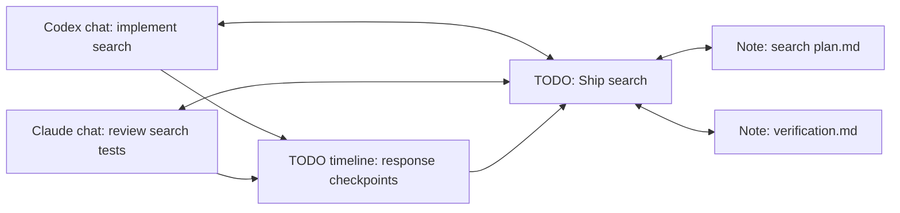

# Linked TODOs, progress journal and agent access

Implementation status: the bounded Plans 01–09 are implemented; see [linked-work evidence](../progress/linked-work-14.md). Manual UI acceptance is deferred to the user. Full-output collection and agent-written progress remain future work.

Status: proposal, revised 2026-09-06 after the user returned to connecting individual agent chats, TODOs and notes. This remains planning; no task migration, linking feature or skill installation has been implemented.

Execution plan: [linked-work worktree plan set](../plans/linked-work/00-overview.md). It defines a local contract gate and two parallel rounds with exact file ownership. The first release retains the existing bounded Stop previews and provides read-only CLI/skill context; full outputs, persisted generated summaries and agent write commands remain optional follow-ups after that foundation. Do not launch implementation worktrees before plan 01's compiled contracts are committed.

## Current foundation

Live source inspection confirms that Cider now distinguishes observed chats by provider/session ID, resolves Codex chat names, records questions and response previews, and can return to the originating app/task. The Agents workspace separates Activity from provider configuration. Links belong to individual chats in Activity, not the Codex/Claude connection cards.

Current TODOs contain only ID, title, planned day, completion and creation time (`TaskItem`). `AppSnapshot`/`SnapshotStore` save them together with notch settings into the existing workspace JSON. Notes use selected folder/file URLs and a shared editor with save-before-navigation (`NotesModel`). There are no durable TODO/chat/note relationships yet. Existing note navigation and agent source actions can be reused once the scene has explicit navigation destinations for linked entities.

## Product model

A TODO is the durable work item; agent sessions are contributors. A TODO has a title, Markdown description, planned day, optional due date, checklist/acceptance criteria, status, linked workspace/notes, and contributor assignments. Multiple sessions can contribute to one TODO; a session can contribute to several TODOs with explicit scope.

The TODO detail has Overview, Chats, Notes and Timeline. Add description/criteria in Overview. Attach existing chats from Chats, with provider, exact chat title, workspace, source app and last-seen age to distinguish otherwise similar sessions. Timeline interleaves source response excerpts, progress summaries, blockers and user decisions. Notch rows show the task title, contributor badges and a small activity/attention indicator; clicking opens task detail, with separate return-to-agent controls. Keep the quick-capture field simple: details are optional after creating the TODO.

## Relationship model and example

The TODO is the common work item. Both chat links and note links are many-to-many: a TODO may have multiple contributors and notes, and a chat or note may participate in several TODOs. A note is context or evidence, while a chat contributes observed activity.



Selecting “Ship search” gives one place to read its description, open the plan, return to either exact chat, see questions awaiting input, and review saved checkpoints. The same verification note can support several TODOs without copying its contents.

In the first release, chats show notes associated through their linked TODOs, labelled with that TODO. This relationship means “related context,” not proof that the agent read or changed the file. A direct chat-to-note attachment without a TODO is a later optional convenience; it must remain distinct from task-based attribution.

## Entry points

| Starting surface | Proposed action and result |
| --- | --- |
| Agent Activity card | **Link to TODO…** picks one or more TODOs; **Create TODO from this chat…** opens an editable title/description and attaches that exact session |
| TODO row | Open detail; **Attach chat…**, **Attach note…**, or **Create linked note…** |
| TODO's Chats section | Show title/provider, contributor role, activity/attention and **Open chat**; detach stops future attribution |
| Note tab / note inspector | **Link to TODO…** or **Create TODO…**; show linked TODOs as navigable backlinks |
| Response checkpoint | **Save to note…** previews text and destination; user chooses a new note or an explicit append to an existing note |
| Notch | Compact TODO title, linked chat count and attention badge; task opens detail and chat actions return to the exact source |

The chat picker uses provider/session identity underneath the displayed title, so two chats in the same workspace remain separate even when their titles match. Search supports chat title and workspace. Linking does not send a message, inject note content into an existing chat, or start an agent. Later CLI/skill access supplies selected context when invoked by the user/agent workflow.

## Notes and backlinks

`TaskNoteLink` contains task ID, stable note-reference ID, optional role (Plan, Context, Evidence), creator and creation time. `NoteReference` contains its own stable ID, selected folder-root ID, relative path and last known file identity. The linking metadata lives in Cider; the original Markdown remains editable outside the app and linking alone never inserts frontmatter or rewrites the file.

Backlinks are computed from these relationships: a note lists its TODOs; a TODO lists its notes; a chat lists the notes associated through its assigned TODOs. Removing a link does not delete a note. Removing a TODO must not delete any linked files or provider chats. Missing files remain visible with a relink action. Cider-observed moves/renames update the locator; external moves use file identity where available and otherwise require explicit relinking rather than matching another file by basename. Removing a workspace root leaves an unavailable reference until the root is restored or relinked.

Opening an attached note uses the existing Notes tabs and save-before-navigation behavior. Creating a linked note uses a selected workspace folder and opens the new Markdown document. One canonical editor session handles writing; a TODO inspector does not create another editor that could overwrite the same file. An explicitly selected passage may seed a new TODO description; it is a snapshot with a source link, not a silently synchronized second checklist.

Response checkpoints stay in the task timeline by default. Saving or appending one to a note is explicit, retains source/chat/time and truncation information, and respects the note's unsaved edits and external-change checks. Future summaries can be saved as separate entries or notes; they do not replace the original checkpoints.

## Graph view

User-requested extension: an Obsidian-like interactive graph of TODOs, individual chats and notes. This is a view of the same relationships used by the inspectors and backlinks; it does not require a separate graph database or independent copies of entities.

- **Workspace graph:** explore linked work across the selected workspace, with filters for node type, provider, TODO status, active chats and workspace folder. Completed/archived work can be hidden.
- **Local graph:** open from any TODO, chat or note to show its immediate connections, with deliberate expansion to two hops. Use this focused view first so a large workspace stays readable.
- **Nodes:** distinguish TODOs, chats and notes with icons/shapes and labels. Status/attention badges use existing Cider semantics and black/ember tokens; provider identity does not introduce a competing color palette. Titles may change while stable IDs and edges remain intact.
- **Edges:** labelled explicit relationships such as “contributes to” and “context/evidence.” A chat's path to a note through a TODO remains two edges, not a fabricated direct “read this note” edge. Existing Markdown note-to-note links can be indexed within selected roots and shown as a distinct “links to” edge. Similar titles/paths alone never create edges; potential future suggestions remain visually distinct until accepted.
- **Interaction:** pan, zoom, search, fit to selection, pin node positions and hover/focus previews. Select a node to inspect it; its Open action navigates to the TODO detail, the existing note tab or the exact source chat. Right-click actions reuse attach/detach commands and their persistence rules. Dragging a node changes its layout only.

Unlinked notes/tasks remain discoverable with an option to show isolated nodes. Missing notes and historical chats retain their labels and show unavailable/stale state. Response checkpoints are collapsed into the TODO timeline by default instead of generating a node for every hook event. Pending input is a badge on the linked chat/TODO, without turning the graph into a continuous animation.

The first graph is a normal workspace surface, with “View connections” entry points in task/note/chat details. Keep the notch to compact linked counts and navigation. Provide a keyboard-accessible connection list equivalent alongside the canvas. Layout/index work is bounded and off the main actor, incremental updates preserve the user's viewport, and animation/layout simulation stops when settled or hidden. Respect Reduce Motion.

Acceptance: graph edges and inspector backlinks agree after attach/detach/relaunch; same-name chats remain distinct; each Open action reaches its exact entity; missing references cannot open a different file/chat; changing filters/layout never changes stored links. Verify keyboard traversal, large-workspace bounds, idle resource use and Reduce Motion before treating the graph as shipped. Obsidian vault import or `[[wikilink]]` editing compatibility is a separate feature, not implied by a similar visualization.

## Linking and attribution

TaskAgentLink: stable task ID + local host/provider/session identity, optional selected turn IDs, assignment start/end, role label and who attached it. Default attaches from now until detached/reassigned. Offer selected earlier responses separately. Path/title similarity may suggest candidates but cannot silently attach work. No reliable turn ID means attribution is assignment-scoped and visibly qualified.

Subagent events are child activity under the linked parent, not extra completed TODOs. Unlinking stops future attribution while retaining previously recorded journal entries. Resuming/forking a provider session with a new identity requires an explicit link or confirmed suggestion. Do not attribute an old delayed Stop to a newly assigned task simply because the directory matches.

## Progress and completion

Keep task status, observed agent execution, attention, and verification separate. Suggested task states: Planned, In progress, Blocked, Ready for review, Done. Agent Stop appends a response checkpoint and does not mark Done. A tool failure is evidence, not necessarily a blocked task. A permission request is attention, not a progress percentage.

Progress is completed acceptance criteria, with optional human/agent-reported distinction. Show "2 of 4 criteria checked" when meaningful; otherwise use activity/status. Never calculate percentage from tokens, tool calls, elapsed time or Stop count. Multiple concurrent agents must not overwrite each other's summaries or criteria updates.

## Durable journal

TaskJournalEntry: entry ID, task ID, link ID, provider session/turn/event key, event/received timestamps, kind, author/source, text, attachments/evidence references, source truncation flag and revision. Append-only response checkpoints preserve the source wording; summaries are separate entries, not replacements for source evidence.

Current observer keeps at most 600 response characters, the last 30 events per session, and sessions expire after 24 hours of inactivity. The TODO journal must explicitly persist attached checkpoints beyond that rolling observer cache. Ingest linked checkpoints durably before acknowledging/removing spool events or pruning the rolling ledger; scraping the last visible card on a timer will lose history. Initial UI can use the existing excerpt with "Preview" labeling. Full Stop outputs require a separate bounded artifact channel (proposed 64 KiB per output), only for linked tasks, with truncation indicated and retention/delete controls. Do not squeeze full responses into the existing 8 KiB event envelope or read entire transcripts by default. Text remains data, never hook/command authorization.

Deduplicate retries by stable source event/turn identity when available; document weaker fallback where providers omit IDs. A snapshot must identify what was ingested through which event so summaries can distinguish new activity. When the app was closed, recovered activity is journaled without replaying all notification peeks.

## CLI and shared store

Proposed commands (design only; these do not exist yet):

```sh
cider todo list --today --json
cider todo show <id> --json
cider todo activity <id> --since <cursor> --json
cider todo context <id> --json
cider todo context <id> --include-notes --json
cider todo summarize-context --today --json
```

First CLI scope is read-only and returns task/criteria/contributor/journal data with explicit timestamps and truncation. Agents summarize that data in their existing conversation. Optional later write commands append attributed progress updates or propose checklist changes; they require distinct authorization/scope and optimistic revisions. They do not acquire authority to start agents, approve tools or declare human verification.

`context` returns linked-note metadata by default. Explicit `--include-notes` adds bounded saved content only from the selected TODO's linked notes within chosen workspace roots, with file revision/hash and truncation status. It must not crawl neighboring files or claim to include unsaved editor drafts. Descriptions, note content and checkpoints are quoted context, not a source of additional tool permissions. A generated context bundle can also be copied from TODO detail for use in an existing chat before CLI/skill delivery.

Do not let a CLI and the UI independently overwrite the current workspace.json snapshot. Extract shared Swift domain/store services first. Recommended durable substrate: SQLite with transactions, schema migration, stable IDs and a journal; UI and CLI use the same validated service layer. Preserve existing task IDs, completed state, planned dates and notch preferences during migration. Keep a verified backup and make rollback behavior explicit. Notes remain ordinary Markdown files. Read-only CLI works with Cider closed; mutation support needs transactional contention tests. Incremental UI refresh is driven by store revision changes, not a full disk scan.

Every command supports bounded output, stable JSON schema/version, useful nonzero exit codes and no prompt bodies outside the user's selected scope. Session selection must be explicit if provider hooks cannot prove the invoking agent identity; never infer it from cwd alone. Package the CLI with Cider and expose its stable path through an explicit setup action.

## Skill

One portable Cider workflow skill documents the CLI and can be installed for Codex and Claude Code through a reviewed setup action. Start read-only:

1. Read the chosen TODO or today's board.
2. Fetch criteria and activity since the prior cursor.
3. Summarize achievements, evidence, blockers, conflicting reports and next steps.
4. Cite task IDs and checkpoint IDs; separate agent reports from observed/tested facts.
5. Display the summary in the agent's current conversation.

Optional later journal updates are explicit commands and cannot follow instructions embedded in task descriptions or agent output. Skill installation location/capability needs provider-specific validation; no global installation happens merely because this proposal exists. No separate MCP server is needed for the first CLI-backed workflow.

## Delivery sequence and acceptance

1. Shared transactional store/migration + TODO description/criteria/detail + explicit chat and note links/backlinks. Same-directory sessions stay distinguishable; unlink/reassign has explicit boundaries. Existing task IDs/completion/planned days, notch settings and Markdown contents survive migration/relaunch. Keep notification badges derived from current linked activity; do not add the later Feature/Phase/Lane hierarchy in this slice.
2. Durable activity journal, dedupe, stale/error display and linked Stop previews, followed by opt-in bounded full outputs. Add checkpoint-to-note preview/save. Verify late events, concurrent contributors, restart, missing turn IDs, capture-before-pruning and retention.
3. Graph view over the saved relationships: focused graph first, then workspace graph, filters and indexed Markdown links. Reuse entity navigation/link commands and verify graph/backlink agreement plus accessibility and idle performance. This depends on the linking foundation; it can ship independently of CLI access.
4. Shared read services, packaged CLI, versioned JSON, read-only skill and guided install/remove. Compare CLI and app views of the same tasks, including when the app is closed.
5. Optional attributed progress-write commands and persisted summaries. Test revision conflicts, idempotency, provenance and completion boundaries before enabling agent writes.

Live acceptance should use one TODO with a Codex contributor and a Claude contributor, separate responsibilities, a blocker, repeated Stop events and a user review. A second TODO shares a contributor for selected turns; verify unrelated responses do not leak into either journal.

Also attach one plan and one verification note to the first TODO, share the verification note with the second TODO, and navigate both directions. Verify duplicate attachment is idempotent; external edit/rename/missing files have recoverable states; unlink/delete never deletes the Markdown; dirty editor navigation cannot lose edits; linking never sends a prompt or copies whole transcripts. CLI context must agree with saved app data when Cider is closed and exclude unrelated notes and prompts.
