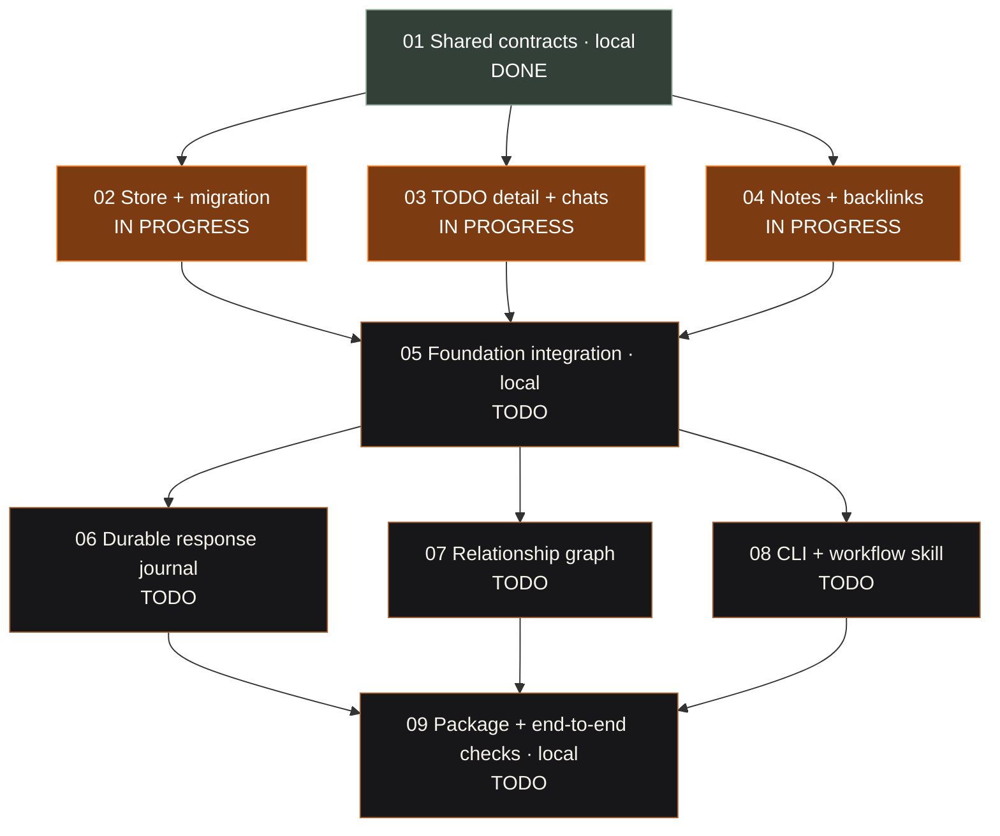

# Linked work — parallel implementation plans

Design source: [linked TODOs, chats, notes, graph and CLI/skill](../../plan/05-linked-todos.md). Shared specification: [contract-spec.md](contract-spec.md). Machine-readable ownership: [ownership.json](ownership.json).

This plan set connects individual agent chats in **Activity** to TODOs, and TODOs to ordinary Markdown notes. A TODO gains a description, criteria, status, contributor assignments and durable response previews. Notes gain backlinks. The graph explores those same saved relationships. A read-only CLI and portable skill give Codex/Claude Code selected context to summarize in the current conversation.

There are **two rounds of three parallel lanes**, with local contract/integration phases between them. This fits one coordinator plus three worktree agents. Plan 01 is implemented and verified locally. Plans 02–04 are running in separate worktree tasks using Terra with High reasoning, with goal mode requested in each start prompt.

## Scope and delivery boundary

The first integrated release includes many-to-many chat/TODO/note links, exact entity navigation, migration, response/question preview retention, explicit checkpoint-to-note save, local/workspace graph, bounded context export, and read-only CLI/skill setup. Hook activity never marks a TODO Done or proves a criterion passed. Configured provider cards remain in Agents; individual contributing chats are chosen from Activity.

Existing 600-character Stop previews are the first durable checkpoint format and must be labelled as previews. Full outputs beyond that cap, agent-written progress/checklist updates and persisted generated summaries are **follow-up plans after this set**, each needing another reviewed contract. They are not hidden acceptance requirements for these nine plans. Once 08 ships, the skill can summarize available context in its current chat. Direct chat-to-note links without a TODO, Feature/Phase/Lane hierarchy, remote sync, Obsidian vault import/wiki-link editing and similarity-generated edges are also outside this set.

## Baseline and reproducibility

Source anchor: `192b50f0a83c1163009d229026ae1733c3f229a9` — `Record current Cider native app baseline`. At planning time the checkout had no commits. Recording the existing app made worktree sources reproducible; the root-only `/dist/` ignore now preserves the committed offline editor runtime under `Sources/CiderPlatform/Resources/editor/dist/`. Vendor licenses and attribution stay with those assets. No build products, credentials or user data were included.

`swift test` passed **53 tests in four suites** on this source baseline. This verifies the existing native test suite, not the proposed features. The plan-only commit adds no runtime behavior and does not relaunch Cider. Source quotes in each plan use this hash; post-contract declarations are new evidence that the coordinator must record before worktrees start.

Fresh worktrees lack `.build`, `.cache`, `dist/Cider.app`, local observer data and the user's saved workspace. Tests must seed temporary data from committed synthetic fixtures. Never read/copy real note/transcript/auth data to make a fixture. SDK SQLite is the planned storage dependency; Cinder's existing `workspace.json` path is the migration source, while Cider's new `work.sqlite` is the destination.

## Binding collaboration rules

1. Edit only your plan's listed files. [ownership.json](ownership.json) and the matrix below must agree. Files transferred between sequential phases are not concurrently owned. Shared overview/spec/root progress belong to the coordinator, even when the Cider skill normally asks a worker to update progress.
2. All worktrees in a round start at the **same exact committed base after the preceding gate**. Do not start 02–04 from the source baseline or plan-only commit. Do not start 06–08 before 05 is merged and verified. Never pull/rebase a sibling into a lane.
3. Plan 01 builds real declarations/schema/fakes first. Freeze the files listed below and public signatures in seeded implementation files. A lane records `CONTRACT CHANGE NEEDED (not made)` instead of changing them. If no useful workaround exists, hand the dependency to the coordinator; do not call incomplete work complete.
4. Swift 6 strict concurrency; MainActor owns presentation, bounded blocking file/SQL work stays on a dedicated utility boundary. No unchecked Sendable convenience, unrelated refactor or extra package dependency. Keep components small and existing black/ember controls, including `CiderPillPicker`.
5. No `.env`, credential/cookie/auth-store inspection, live transcript fixtures, content logs or automatic hook/settings changes. Stored text is data, not permission. Links never send prompts, launch tasks, approve tools or prove completion. Skill installation has exact preview/removal and is user-triggered.
6. Lanes run builds and synthetic tests only. `script/build_and_run.sh --verify` stops/relaunches the globally running app and can fetch helper dependencies; **only the coordinator runs it**, after fixture checks and with recoverable user data. Signing/release, native UI, live-provider and hardware checks remain separately reported evidence.
7. Use each plan's `linked-work/NN-slug` branch (the explicitly invoked fanout skill's naming). Plain local commits, no push/PR, no automatic worktree deletion. The coordinator uses the main checkout for 01, 05 and 09 and merges their local phase branches back into `main`.
8. A worker updates only its plan's Deviations/handoff, never status elsewhere. Every departure needs a reason and affected surfaces. Final handoff includes base/head IDs, changed files, each verification command, deviations and remaining gates. Root docs are updated by the coordinator in the same integration milestone.

## Dependency graph and status

Only the coordinator updates statuses here: TODO, IN PROGRESS or DONE. A node is DONE only after its diff/deviations were reviewed, merged and verified. All nodes below are implementation work; the plan set itself is already authored.



There is no unmerged external software dependency in this graph. Native/physical/provider acceptance is part of the local 05/09 gates, not an implied pass from unit tests. Any newly discovered external prerequisite must get a visible gate before dependent work starts.

## Plans and branches

| Plan | Branch | Depends on | Parallel with / location |
| --- | --- | --- | --- |
| [01 — Shared contracts and build seams](01-contracts.md) | `linked-work/01-contracts` | Plan commit | Local coordinator |
| [02 — Transactional store and migration](02-store.md) | `linked-work/02-store` | 01 | 03, 04 |
| [03 — TODO detail and chat attachments](03-task-detail.md) | `linked-work/03-task-detail` | 01 | 02, 04 |
| [04 — Note references, backlinks and context files](04-note-links.md) | `linked-work/04-note-links` | 01 | 02, 03 |
| [05 — Connect TODOs, notes, chats and the notch](05-foundation-integration.md) | `linked-work/05-foundation-integration` | 02, 03, 04 | Local coordinator |
| [06 — Durable response and question history](06-journal.md) | `linked-work/06-journal` | 05 | 07, 08 |
| [07 — Local and workspace relationship graph](07-graph.md) | `linked-work/07-graph` | 05 | 06, 08 |
| [08 — Read-only CLI and portable workflow skill](08-cli-skill.md) | `linked-work/08-cli-skill` | 05 | 06, 07 |
| [09 — Package and verify the complete linked workflow](09-integration.md) | `linked-work/09-integration` | 06, 07, 08 | Local coordinator |

## Frozen after 01

These files are frozen for parallel lanes. Only a deliberate coordinator contract revision can change them:

```text
Package.swift
Sources/CSQLite/module.modulemap
Sources/CSQLite/shim.h
Sources/CiderDomain/LinkedWork/Identity.swift
Sources/CiderDomain/LinkedWork/Tasks.swift
Sources/CiderDomain/LinkedWork/Notes.swift
Sources/CiderDomain/LinkedWork/Links.swift
Sources/CiderDomain/LinkedWork/Journal.swift
Sources/CiderDomain/LinkedWork/Graph.swift
Sources/CiderDomain/LinkedWork/Commands.swift
Sources/CiderDomain/LinkedWork/Repository.swift
Sources/CiderDomain/LinkedWork/NoteAccess.swift
Sources/CiderData/LinkedWork/Schema.sql
Sources/CiderUI/LinkedWork/LinkedWorkModel.swift
Sources/CiderUI/LinkedWork/LinkedRoute.swift
Sources/CiderUI/LinkedWork/FeatureEntryPoints.swift
Tests/CiderLinkedWorkTests/LinkedContractTests.swift
Tests/CiderLinkedWorkTests/Fixtures/linked-v1.json
Tests/CiderLinkedWorkTests/Fixtures/legacy-workspace-v1.json
Tests/CiderLinkedWorkTests/Support/FixtureRepository.swift
Tests/CiderLinkedWorkTests/Support/FixtureNoteAccess.swift
Tests/CiderIntegrationTests/LinkedIntegrationContractTests.swift
```

Also freeze the exported signatures of `SQLiteWorkRepository.open`/repository methods, `LinkedNoteService` methods and the CLI command/JSON/exit contract. Their stub bodies transfer to 02, 04 and 08 respectively. Feature implementation files use the compiled entry-point protocols from 01; sibling features never import an unmerged concrete implementation. Shared fakes/fixtures are read-only; lane-specific cases live in lane-owned test files.

The SQL schema and public DTOs define graph/journal query behavior before store work. This is why 07 and 08 can run beside 06 after 05. Main navigation and legacy task writes are intentionally centralized in 05/09; splitting those files across simultaneous lanes would create competing changes.

## File ownership matrix

Each fenced list is exact; no glob grants. Repeated paths below are sequential transfers. Each numbered plan also describes the functions/sections to change. Coordinator-only planning/progress files:

```text
docs/plans/linked-work/00-overview.md
docs/plans/linked-work/contract-spec.md
docs/plans/linked-work/ownership.json
docs/progress/current.md
docs/plan/05-linked-todos.md
```

<details>
<summary>01 — Shared contracts and build seams</summary>

```text
Package.swift
Sources/CSQLite/module.modulemap
Sources/CSQLite/shim.h
Sources/CiderDomain/LinkedWork/Identity.swift
Sources/CiderDomain/LinkedWork/Tasks.swift
Sources/CiderDomain/LinkedWork/Notes.swift
Sources/CiderDomain/LinkedWork/Links.swift
Sources/CiderDomain/LinkedWork/Journal.swift
Sources/CiderDomain/LinkedWork/Graph.swift
Sources/CiderDomain/LinkedWork/Commands.swift
Sources/CiderDomain/LinkedWork/Repository.swift
Sources/CiderDomain/LinkedWork/NoteAccess.swift
Sources/CiderData/LinkedWork/Schema.sql
Sources/CiderData/LinkedWork/SQLiteWorkRepository.swift
Sources/CiderData/LinkedNotes/LinkedNoteService.swift
Sources/CiderUI/LinkedWork/LinkedWorkModel.swift
Sources/CiderUI/LinkedWork/LinkedRoute.swift
Sources/CiderUI/LinkedWork/FeatureEntryPoints.swift
Sources/CiderCLI/main.swift
Tests/CiderLinkedWorkTests/LinkedContractTests.swift
Tests/CiderLinkedWorkTests/Fixtures/linked-v1.json
Tests/CiderLinkedWorkTests/Fixtures/legacy-workspace-v1.json
Tests/CiderLinkedWorkTests/Support/FixtureRepository.swift
Tests/CiderLinkedWorkTests/Support/FixtureNoteAccess.swift
Tests/CiderIntegrationTests/LinkedIntegrationContractTests.swift
docs/plans/linked-work/01-contracts.md
```

</details>

<details>
<summary>02 — Transactional store and migration</summary>

```text
Sources/CiderData/LinkedWork/SQLiteWorkRepository.swift
Sources/CiderData/LinkedWork/WorkDatabaseIO.swift
Sources/CiderData/LinkedWork/WorkMigration.swift
Sources/CiderData/LinkedWork/WorkQueries.swift
Sources/CiderData/LinkedWork/WorkMutations.swift
Sources/CiderData/LinkedWork/WorkJournalTransactions.swift
Sources/CiderData/LinkedWork/WorkGraphQueries.swift
Tests/CiderLinkedWorkTests/LinkedStoreTests.swift
Tests/CiderLinkedWorkTests/LinkedMigrationTests.swift
docs/plans/linked-work/02-store.md
```

</details>

<details>
<summary>03 — TODO detail and chat attachments</summary>

```text
Features/LinkedTasks/TaskDetailView.swift
Features/LinkedTasks/TaskOverviewView.swift
Features/LinkedTasks/TaskChatPicker.swift
Features/LinkedTasks/TaskLinksView.swift
Features/LinkedTasks/TaskTimelineView.swift
Sources/CiderUI/LinkedWork/TaskDraft.swift
Tests/CiderLinkedWorkTests/LinkedTaskDraftTests.swift
docs/plans/linked-work/03-task-detail.md
```

</details>

<details>
<summary>04 — Note references, backlinks and context files</summary>

```text
Sources/CiderData/LinkedNotes/LinkedNoteService.swift
Sources/CiderData/LinkedNotes/NoteLocator.swift
Sources/CiderData/LinkedNotes/MarkdownLinkIndex.swift
Features/LinkedNotes/NoteConnectionsView.swift
Features/LinkedNotes/NoteAttachmentPicker.swift
Features/LinkedNotes/CheckpointNotePreview.swift
Tests/CiderLinkedWorkTests/LinkedNoteTests.swift
Tests/CiderLinkedWorkTests/MarkdownLinkIndexTests.swift
docs/plans/linked-work/04-note-links.md
```

</details>

<details>
<summary>05 — Connect TODOs, notes, chats and the notch</summary>

```text
App/AppModel.swift
App/CiderApp.swift
App/WorkspaceView.swift
App/NoteCommands.swift
Features/Today/TodayView.swift
Features/Today/TaskRow.swift
Features/Notes/NotesModel.swift
Features/Notes/NotesView.swift
Features/Notes/NoteTabStrip.swift
Features/Notes/WorkspaceTree.swift
Features/Agents/AgentsView.swift
Features/Agents/AgentTrackingModel.swift
Features/Notch/NotchHUDView.swift
App/LinkedWorkCoordinator.swift
Tests/CiderIntegrationTests/LinkedFoundationTests.swift
script/verification/LinkedWorkSmoke.swift
script/verify_linked_work.sh
docs/plans/linked-work/05-foundation-integration.md
```

</details>

<details>
<summary>06 — Durable response and question history</summary>

```text
Sources/CiderData/AgentEventStore.swift
Features/Agents/AgentTrackingModel.swift
Sources/CiderData/LinkedWork/JournalIngestor.swift
Sources/CiderData/LinkedWork/JournalAttribution.swift
Features/LinkedTasks/TaskTimelineView.swift
Tests/CiderLinkedWorkTests/LinkedJournalTests.swift
Tests/CiderLinkedWorkTests/LinkedJournalRecoveryTests.swift
docs/plans/linked-work/06-journal.md
```

</details>

<details>
<summary>07 — Local and workspace relationship graph</summary>

```text
Features/Graph/WorkGraphView.swift
Features/Graph/GraphCanvas.swift
Features/Graph/GraphInspector.swift
Features/Graph/GraphFilters.swift
Sources/CiderUI/LinkedWork/GraphLayout.swift
Sources/CiderUI/LinkedWork/GraphViewport.swift
Tests/CiderLinkedWorkTests/LinkedGraphTests.swift
Tests/CiderLinkedWorkTests/GraphLayoutTests.swift
docs/plans/linked-work/07-graph.md
```

</details>

<details>
<summary>08 — Read-only CLI and portable workflow skill</summary>

```text
Sources/CiderCLI/main.swift
Sources/CiderCLI/CLIArguments.swift
Sources/CiderCLI/TodoCommands.swift
Sources/CiderCLI/CLIOutput.swift
Sources/CiderData/LinkedWork/TodoContextReader.swift
Sources/CiderData/LinkedWork/WorkflowSkillSetup.swift
Features/AgentAccess/AgentAccessView.swift
Integrations/cider-workflow/SKILL.md
Integrations/cider-workflow/README.md
Integrations/cider-workflow/CHANGELOG.md
Tests/CiderLinkedWorkTests/TodoContextTests.swift
Tests/CiderLinkedWorkTests/WorkflowSkillSetupTests.swift
script/verification/verify_cider_cli.py
docs/plans/linked-work/08-cli-skill.md
```

</details>

<details>
<summary>09 — Package and verify the complete linked workflow</summary>

```text
App/CiderApp.swift
App/WorkspaceView.swift
App/LinkedWorkCoordinator.swift
Features/Agents/AgentConnectionsView.swift
Features/Notes/NotesModel.swift
Features/Notch/NotchHUDView.swift
script/build_and_run.sh
script/verify_linked_work.sh
script/verification/LinkedWorkSmoke.swift
Tests/CiderIntegrationTests/LinkedWorkflowTests.swift
docs/product.md
docs/contracts/data.md
docs/contracts/documents.md
docs/architecture.md
docs/implementation/dependencies.md
docs/verification.md
docs/progress/linked-work-14.md
.agents/skills/working-with-cider/references/data.md
docs/plans/linked-work/09-integration.md
```

</details>

## Launch and merge procedure

### Local contract gate

On the clean local main checkout, create `linked-work/01-contracts` and run [01's prompt](01-contracts.md#agent-start-prompt). Build the frozen APIs/schema and run all 01 checks. Merge the local branch into main, record its head and checks here, update P01 to DONE, and commit the overview. **No fanout command is valid before this gate.**

Round A base: **`6eac4d072abd2332c6eb6cfe51d6a02fdbb89522`**. This compiled implementation commit contains the plan set, frozen contracts and fixtures. Later coordinator-only merge-log updates do not change this base. Round B base: not recorded yet; 05 must complete first. The coordinator records each immutable commit plus checks here before dispatch; never reuse the planning source hash as a round base.

### Parallel round A

The local contract gate has passed. Use the pinned implementation commit below for all three worktrees; it is already merged into main:

```sh
CIDER_ROUND_A_BASE="6eac4d072abd2332c6eb6cfe51d6a02fdbb89522"
CIDER_WORKTREE_ROOT="/Users/vatsals/Desktop/qyrus/random/cider-linked-worktrees"
mkdir -p "$CIDER_WORKTREE_ROOT"
git worktree add -b linked-work/02-store "$CIDER_WORKTREE_ROOT/02-store" "$CIDER_ROUND_A_BASE"
git worktree add -b linked-work/03-task-detail "$CIDER_WORKTREE_ROOT/03-task-detail" "$CIDER_ROUND_A_BASE"
git worktree add -b linked-work/04-note-links "$CIDER_WORKTREE_ROOT/04-note-links" "$CIDER_ROUND_A_BASE"
```

Use each plan's final **Agent start prompt** in its worktree. Only dispatch when execution is requested; writing this plan set does not create user tasks. If a branch/worktree already exists, inspect its base/changes instead of resetting it. The plan set does not require a particular agent model; honor an explicit execution-time model choice and applicable repo instructions.

### Review/merge round A and integrate

Read each lane's Deviations first. Compare `git merge-base <lane-branch> main` to the recorded round base; inspect `git diff --name-only <base>..<lane-branch>` against ownership. Review changed source anchors since the base, not just merge cleanliness. Then, on the local coordinator main checkout:

```sh
git merge --no-ff linked-work/02-store
# Run plan 02 checks and inspect the merged diff before continuing.
git merge --no-ff linked-work/03-task-detail
# Run plan 03 checks and inspect the merged diff before continuing.
git merge --no-ff linked-work/04-note-links
# Run plan 04 checks, then the full Swift test suite.
```

02–04 can merge in any order because ownership is disjoint. Conflicts signal an ownership or base problem; do not blindly choose ours/theirs. Wrong-base lanes require a reviewed fresh branch/cherry-pick, source-freshness check and full lane re-verification. Larger integration discoveries become a revised/new plan; small repairs are coordinator-owned with an explicit ownership amendment/deviation.

Update the graph/log and commit. Run [05](05-foundation-integration.md) locally on `linked-work/05-foundation-integration`, merge it back into main, run its gates, record the result and commit the overview. Only that new tip can seed round B.

### Parallel round B and final integration

After 05's verified clean tip, create all three worktrees from a newly captured identical base:

```sh
CIDER_ROUND_B_BASE="$(git rev-parse HEAD)"
CIDER_WORKTREE_ROOT="/Users/vatsals/Desktop/qyrus/random/cider-linked-worktrees"
git worktree add -b linked-work/06-journal "$CIDER_WORKTREE_ROOT/06-journal" "$CIDER_ROUND_B_BASE"
git worktree add -b linked-work/07-graph "$CIDER_WORKTREE_ROOT/07-graph" "$CIDER_ROUND_B_BASE"
git worktree add -b linked-work/08-cli-skill "$CIDER_WORKTREE_ROOT/08-cli-skill" "$CIDER_ROUND_B_BASE"
```

Dispatch their individual prompts. Merge/review/check in any order using the same process, then run [09](09-integration.md) locally on `linked-work/09-integration`. It owns packaging, real app composition, full-flow checks, docs and final evidence. Merge back to main only with its required gates met; leave unresolved acceptance visible instead of calling builds end-to-end proof.

## Acceptance across the complete set

- Existing tasks/IDs/planned days/order/completion/notch settings survive import and relaunch. One transactional task writer; rollback preserves newer edits. CLI reads never create/migrate a DB.
- Two same-title chats in one workspace attach independently. Multiple contributors and shared notes retain explicit identity, scopes and backlinks. Unlink/delete never deletes user notes or provider chats.
- Stops/questions are durably saved before acknowledgement, replay-safe at available source identity, with preview limits/provenance shown. Task state and criteria remain user-owned. Recovered events do not replay notification storms.
- Dirty note navigation/append cannot lose edits. Missing/renamed files remain recoverable. Linking and graph indexing do not rewrite Markdown or invent edges.
- Graph and inspector/backlink data agree; keyboard/list navigation and exact Open actions work. Limits, viewport stability, settled/hidden resource behavior and Reduce Motion are checked.
- Packaged CLI and skill return bounded saved context while Cider is closed; usage does not install hooks or mutate TODOs. Setup/remove is explicit and preserves unrelated files. A real user-invoked provider summary is checked separately from CLI fixtures.
- Each plan's changes and same-commit docs/skill requirements are met; all deviations are reconciled. No push or PR target is requested. Final report separates synthetic, native, live-provider, hardware and distribution evidence.

## Merge log and next recommendation

- **Planning baseline:** `192b50f0a83c1163009d229026ae1733c3f229a9` records the existing native app and essential offline editor assets. `swift test`: 53 passed. No user data/config changes or app relaunch.
- **Plan authoring:** nine bounded plans, explicit contract specification, complete ownership matrix and start prompts. Validation checked both parallel ownership sets, the dependency graph, all 29 anchored source quotes, prompt requirements and relative links. No implementation worktree or agent dispatched.
- **Plan 01 merge:** `linked-work/01-contracts` → `6eac4d072abd2332c6eb6cfe51d6a02fdbb89522`, merged locally into main at `4c757fadcaaf423abcb9244228b592fa24215083`. Original lane base: `34d1ef8`. This is the common round A source base; subsequent changes here only record the handoff.
- **Plan 01 verification:** Cider, cider-cli and cider-events build; 62 tests pass. The schema, declarations, UI adapter, side-effect-free seeds, synthetic fakes and app import seam are compiled. See [01 deviations and evidence](01-contracts.md#deviations). No production migration or deployment; the CLI smoke collision was corrected as recorded in 01.
- **Next:** 02, 03 and 04 are ready for parallel work from the pinned implementation commit. Keep 06–08 behind the actual 05 integration gate.

Append each later round's base/head IDs, accepted deviations, checks and recommendation here. Implementation status belongs only to the graph above.
